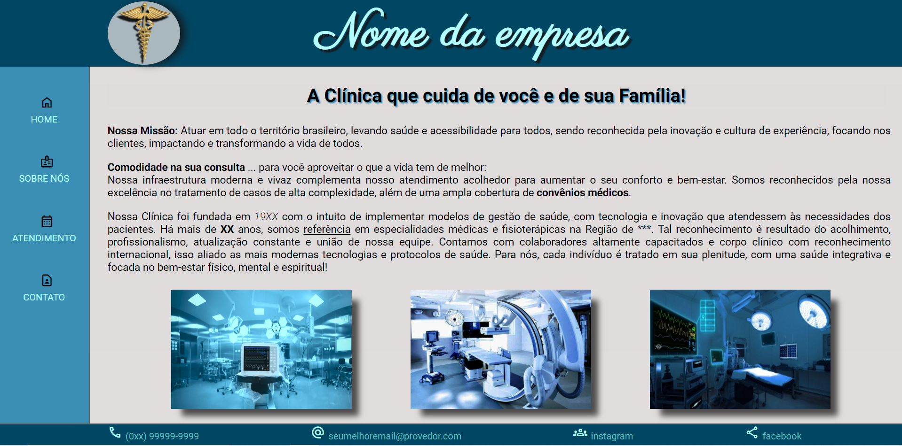
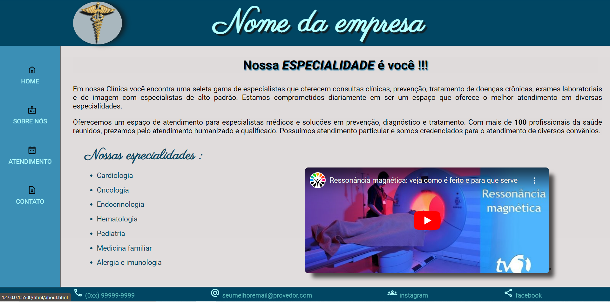
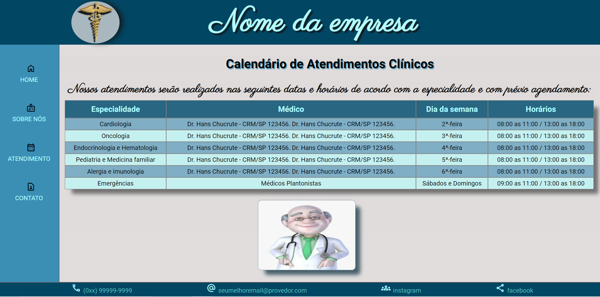

# Desafio-de-projeto-HTML-2-DIO

Academic project for delivery

> Result of the finished project. This project aimed to establish knowledge of HTML structuring and semantics:
 

- 
- 
 

 

#### 🤝 Collaborators

<table>
  <tr>
    <td align="center">
      <a href="https://www.linkedin.com/in/edmar-radanovis-0130b611a/">
         
        
          <b>Edmar Radanovis</b>
        
      </a>
    </td>
    <td align="center">
       <a href="https://www.dio.me/">
         
        
          <b>DIO.me</b>
        
      </a>
  </tr>
</table>

[⬆ Voltar ao topo](#desafio-de-projeto-html-2-dio) 
